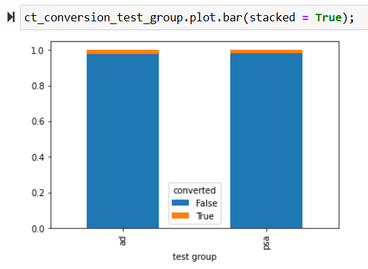
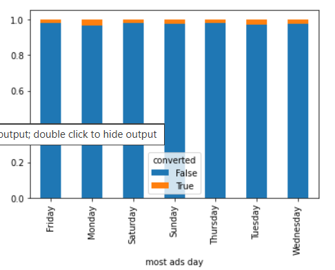
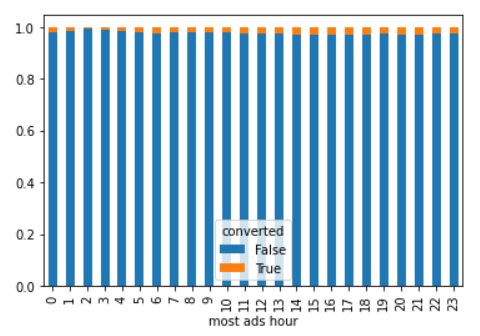

# Marketing A/B Testing Analysis

## 📌 Project Overview

This project analyses the effectiveness of a digital marketing advertisement using **A/B testing**. Users were divided into an **Ad (Treatment) group** and a **PSA (Control) group** to determine whether exposure to the advertisement was associated with higher conversion rates.

## 🎯 Business Objective

Determine whether the marketing advertisement improves user conversion compared with the control group.

## 🛠️ Tools & Technologies

* Python
* Pandas
* NumPy
* Matplotlib
* Seaborn
* SciPy
* Jupyter Notebook

## 🔍 Analysis Performed

* Data cleaning and validation
* Exploratory Data Analysis (EDA)
* Univariate and bivariate analysis
* Conversion-rate analysis
* Ad exposure analysis
* Chi-square test of independence
* Normality testing using Shapiro-Wilk
* Variance testing using Levene's test
* Mann-Whitney U test

## 📊 Exploratory Analysis

### Treatment and Control Groups

The experiment consists of an **Ad (Treatment) group** and a **PSA (Control) group**.

### Conversion by Test Group

Conversion rates were compared between the Ad and PSA groups to evaluate the effectiveness of the marketing advertisement.

### Conversion by Day

Conversion rates were analysed across different days to identify potential differences in user response based on the day of advertisement exposure.

### Conversion by Hour

Conversion rates were also analysed across different hours to identify potential patterns in conversion behaviour.

## 📊 Key Findings

* The Ad group achieved a higher conversion rate than the PSA control group.
* Ad group conversion: **~2.55%**
* PSA group conversion: **~1.79%**
* The difference between the two groups was statistically significant based on the Chi-square test.
* Conversion rates varied by the day and hour of advertisement exposure.
* Converted users had a substantially higher median number of ad exposures than non-converted users.
* The Mann-Whitney U test indicated a statistically significant difference in `total ads` between converted and non-converted users.

## 📈 Statistical Approach

For categorical variables, the **Chi-square test of independence** was used.

For the numerical variable `total ads`, distributional assumptions were assessed using **Shapiro-Wilk** and **Levene's tests**. Since the assumptions for a parametric t-test were not satisfied, the **Mann-Whitney U test** was used.

## 💡 Business Insight

The analysis indicates that advertisement exposure is associated with higher conversion in this dataset. However, statistical association should not automatically be interpreted as causation, particularly when analysing the relationship between the number of advertisements shown and conversion.

## 📂 Files

* `Marketing_AB_Testing.ipynb` — Complete Python analysis
* `marketing_AB.csv` — Dataset
* `images/` — Selected visualizations used in this README

## 👤 Author

**Bharat Reddy**

Data Analytics | Business Analytics | Python | SQL | Power BI
